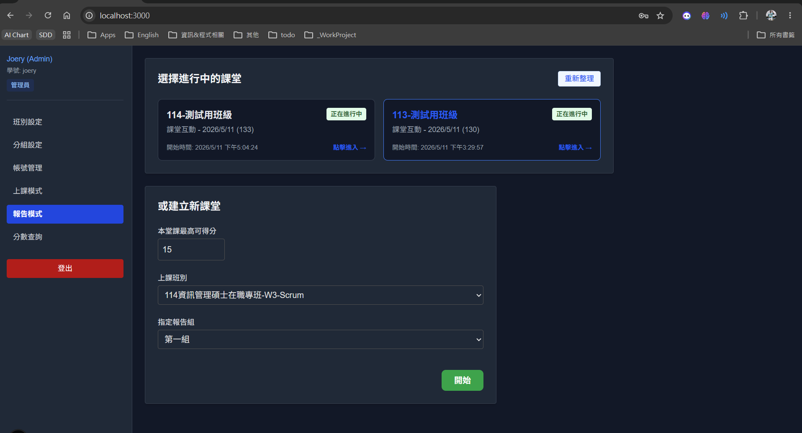
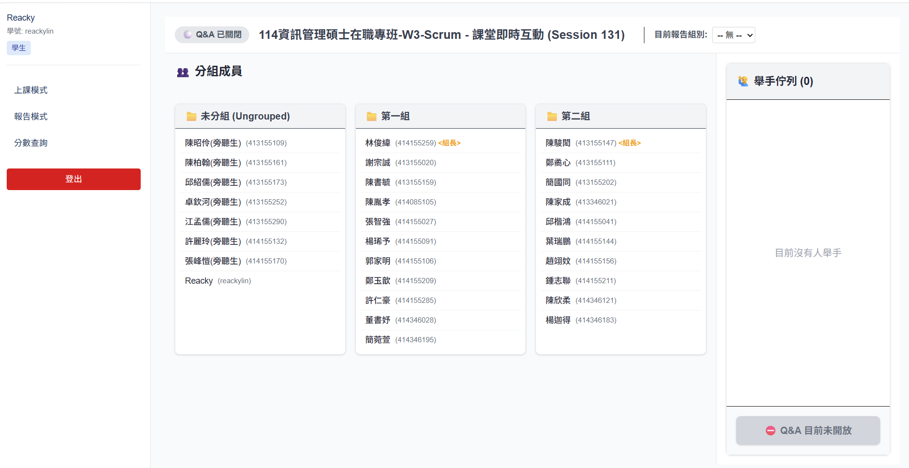
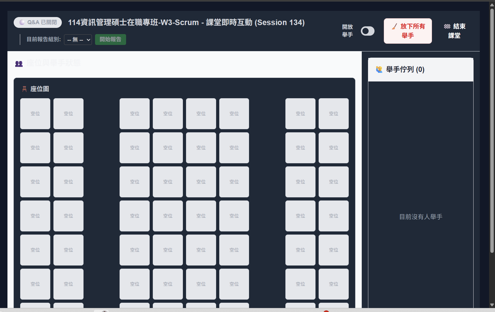

# 上課模式與報告模式

---

我的課堂互動系統在老師與學生互動中可以在左邊功能選單中看到2個主要功能：  
- 報告模式
- 上課模式
  
這二個模式很相似但在進入後呈現方式不一樣，我目前git branch『feature/SP1006-ClassMode』以報告模式為主已完成開發和測試。現在另一組員加入上課模式改到我的檔案了，我想請你幫我重新重構，我會在以下以圖示說明：

## 報告模式(Report)
> 目前程式皆是正確版本

### 1. 點選進報告模式
- Page 1: 上方呈現老師/學生所屬正在線上的課呈供選擇，下方才是建立報告組別。如下圖<請怱略瀏覽器之色系 

- Page 2: 進入報告模式


-參考文件
參考文件../../sprint02/*.*

## 上課模式(Class)
- Page 1: 應跟報告模式一樣，上方呈現目前老師、學生所屬課呈正在線上的；下方才是建立上課
  - 上方呈現
    - 資料表:sessions
    - 找尋有建立課程的課堂 , 判斷式 ends_at IS NULL
  - 建立課程
    - 資料表:sessions

- Page 2: 上課模式畫面

上課模式進入第2頁後，學生應可以自己選擇座位,然後依選取座擇量綠燈(淺綠色代表已有學生入座)
顯示姓名 若有舉手在座位上, 和舉手清單皆亮舉手符號,這部份所有規則請參考報告模式
還有計分方式
PS. 最重要的要切分開來

- 每位學生依坐位表自己選坐位
- 選完坐位表後記錄在資料表:session_seats
- 提供一個模式坐位表呈現方向 黑板在前、黑皮在後，提供一個開關180度鏡向功能呈現
- 其他舉手相關功能皆與報告模式同作法
- 要與報告模式切開不能共用同程式


# 主要需求
```Prompt
之前另外同學開發後蓋掉了我的報告模式程式了，我取我自己最新版本目前分支現在程式
請幫我重構，將報告模式的page01, page02 和相關都在各式資料夾內或用檔案切分開來，報告模式:Report、上課模式:Class關鍵字來區分。
請在目前報告模式的程式中，依我上述之功能需求加入 "上課模式" 之需求
```