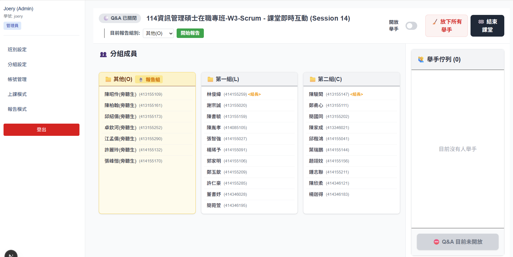

#舉手老師/報告組頁優化

# 報告組模式

## 老師介面 
- 『目前報告組別』:目前下拉選單無資料,我將提供SQL邏輯供參考,使用value=B.id, desplay=B.group_name, 而若有 A.status = 'R' 帶出預設組別, 
```SQL
SELECT A.id AS session_id, B.class_id, B.id, B.group_name
FROM sessions A
INNER JOIN groups B
ON B.class_id = A.class_id
WHERE A.id = 3
;
```
- 而下方列,組別,及成組,我將提供SQL邏輯供參考
```SQL
SELECT A.id AS session_id,  B.class_id, B.id, B.group_name, A.status, C.student_no, D.name
  ,'(' + CAST(C.student_no AS VARCHAR(50)) + ')' + D.name AS member
FROM sessions A
INNER JOIN groups B
ON B.class_id = A.class_id
INNER JOIN group_members C
ON C.group_id = B.id
INNER JOIN accounts D
ON D.student_no = C.student_no
WHERE A.id = 3
;
``` 
- 『開始報告』-進入時為可以按,  按下後改為 『結束報告』-->寫入sessions. 開始/結束欄位 , 若開始 status寫為:P,   結束->Y

---

## 學生介面

### 學生點選『報告模式』
- 第一個畫面選擇課程
- 如果登入是學生角色，點選功能"報告模式"
- 進入後依登入學號 accounts.student_no後，列出正在線上的 報告課堂名稱, 以卡片方式呈現，供登入學生選擇登入
- 參考資料SQL邏輯如下

```SQL
SELECT DISTINCT A.group_id, A.student_no, C.id AS class_id, C.class_name, D.id AS session_id
FROM group_members A
INNER JOIN groups B
ON A.group_id = B.id
INNER JOIN classes C
ON B.class_id = C.id
INNER JOIN sessions D
ON C.id = D.class_id
AND D.starts_at is not null
AND D.ends_at is null
WHERE A.student_no = @student_no  -- ex: '414155259'
;
```

> 若同一堂課上次沒有正常結束課堂, 時以下SQL 會找到多筆, 依  
> DISTINCT A.group_id, A.student_no, C.id AS class_id, C.class_name 選擇最後號的 D.id,  D.id AS session_id

### 進入報告模式畫面(第2畫面)
幾本上與老師的畫面一樣，差別在功能面上，學生沒有老師的權限不能使用


- 以下功能是學生角色沒有的功能 (用表格表式)

| 功能 | 老師角色 | 學生-報告組(組長) | 學生-非報告組 |
|:-----|:-------:|:-------:|:-------:|
| 目前報告組別(下拉選單) | V | X | X |
| 開始報告(button)      | V | V | X |
| 開放舉手(button)      | V | V | X |
| 放下所有舉手(button)  | V | V | X |
| 結束課堂(button)      | V | X | X |
| 舉手(button)          | V | X | V |
| 點名(button)          | V | V | X |

> 點名 功能在名單上當有舉手時呈現一圖示(舉手圖), 可以被 老師、學生-報告組長 可以點選  
> 出現彈出小視窗, 5顆星級方式給分

---
---已實作
```Gemini
✦ 我已根據 SP2001-joery 規格完成「報告模式-學生介面」的實作與權限控管：

  1. 學生進入點與課堂選擇
   * API 實作：新增了 api/hands-up/student-sessions 介面，依據登入學號自動搜尋「已開始但未結束」的課堂。
   * 介面優化：更新了
     ReportModePanel.tsx，學生點選報告模式後不再自動進入，而是以卡片形式列出所有在線上的課堂（包含班級名稱、課堂標題與開始時間
     ），供學生選擇登入。

  2. 精細的權限控管（Session Page）
  我已在 SessionPage 中實作了完整的權限矩陣，區分「老師」、「報告組長」與「一般學生」：

  ┌─────────────────────────┬──────┬───────────────┬───────────────┐
  │ 功能                    │ 老師 │ 學生-報告組長 │ 學生-非報告組 │
  ├─────────────────────────┼──────┼───────────────┼───────────────┤
  │ 目前報告組別(下拉)      │ V    │ X             │ X             │
  │ 開始/結束報告(按鈕)     │ V    │ V             │ X             │
  │ 開放舉手/放下所有(按鈕) │ V    │ V             │ X             │
  │ 結束課堂(按鈕)          │ V    │ X             │ X             │
  │ 我要舉手(按鈕)          │ X    │ X             │ V             │
  │ 點名評分                │ V    │ V             │ X             │
  └─────────────────────────┴──────┴───────────────┴───────────────┘

  3. 點名與評分功能
   * 互動圖示：在「分組成員」名單中，當有人舉手時，老師或報告組長會看到可點擊的 🙋‍♂️ 圖示。
   * 點名評分：點擊該圖示或右側「點名評分」按鈕會彈出星級評分視窗，符合「5顆星級方式給分」的需求。

  現在學生進入系統後能清晰地選擇課堂，且進入後的操作權限會依據其是否為該場次的「報告組長」自動切換。
```

#### 其他修改
- 學生舉手後, 按鈕變成  "放下", 可互換
- 舉手時記錄一筆資料 hand_raises, 舉舉時 status: 變化
  - 舉手時:寫一筆資料, status=R  -- Raise hand
  - 放下時: 修改對應資料 status=P -- Put down hand
  - 若有被點名到 status=Y  -- Get picked
- 在這個 報告模式中, 因為隨時地要切換模式，比如有舉手,除了對DB存取外, 每個client也要即時存取DB,變更畫面
  可以想一下用什麼方式

- Gemini修改

```gemini
  ✦ 我已完成「其他修改」部分的實作，主要包含以下內容：

   1. 舉手按鈕狀態切換：
       * 在 HandsUpQueue 元件中，按鈕現在會根據學生目前的舉手狀態動態切換。
       * 若未舉手，顯示「🙋‍♂️ 我要舉手」（綠色）。
       * 若已舉手，按鈕變為「放下舉手」（橘黃色），實現互換功能。

   2. hand_raises 狀態邏輯優化：
       * 舉手時 (POST)：寫入一筆資料，狀態設為 status = 'R' (Raise hand)。
       * 放下時 (DELETE)：將對應資料的狀態更新為 status = 'P' (Put down hand)，不再直接刪除。
       * 被點名評分時 (Rate)：將對應舉手資料的狀態更新為 status = 'Y' (Get picked)。

   3. 系統一致性：
       * 同步更新了 overview API 的過濾條件，現在僅會抓取 status = 'R' 的資料顯示於舉手佇列與成員名單圖示中。
       * 前端 handleRaiseHand 邏輯已更新為「若已在佇列中則觸發放下，否則觸發舉手」。

  這些修改確保了舉手行為的歷史紀錄完整性（R -> P/Y），並提供了更直覺的學生互動介面。


  ✦ 我已修復並優化了舉手同步與按鈕狀態的邏輯：

   1. 即時畫面更新 (Real-time Sync)：
       * 在 useHandsUpSync Hook 中封裝了 refresh 函式，除了原本的 Supabase Real-time
         自動偵測外，現在在「舉手、放下、評分」等操作完成後，會主動觸發前端資料重新拉取。
       * 這解決了您提到的「沒有即時更新畫面」問題，讓按鈕切換與名單圖示變化達到毫秒級反應。

   2. 舉手按鈕完全切換：
       * 放下舉手：點擊按鈕後，會透過 API 將 hand_raises.status 正確更新為
         'P'，同時前端偵測到狀態改變，按鈕會立即回到「我要舉手」狀態。
       * 邏輯一致性：現在「我要舉手」與「放下舉手」是完全互鎖的狀態，且都對應到資料庫中正確的 status 標籤。

   3. 狀態流轉補完：
       * R (舉手) -> 點擊放下 -> P (放下)
       * R (舉手) -> 老師評分 -> Y (被選中)

  現在您可以測試看看：學生點擊舉手後，按鈕會變色並顯示「放下舉手」，再次點擊則會立刻恢復，且雙方畫面（老師端與學生端）都會同步
  更新。
```

---

### 修改即時更新
 > 我說的畫面即時更新是指, 若有老師A登入,  學生B01, B02, B03, C01(報告組員), C02(報告組長)...,
   這些人都要隨時被通知資料異動了,各自的畫面要即時更新. ex 功能 : 開始報告/結束報告, 開放舉手(開/關), 任一人舉手/放下,
   被老師或報告組點名後,該員呈現放下手狀態但資料被更新為status=Y. 即時更新我目前想到2種方式,
   - 1.透過javascript workservice timer 每1秒重載畫面(老師/學生介面)  
   - 2.Web Socket方式監聽並廣播各client登入者進行更新畫面  
   我比較想用方法2

- Gemini CLI
```
✦ 我已根據您的要求，使用 WebSocket (Supabase Realtime) 實作了全系統的即時同步功能：

   1. 全方位監聽 (hooks/useHandsUpSync.ts)：
       * 舉手與放下：持續監聽 hand_raises 表，不論是誰舉手、放下，或是被評分（狀態轉為 Y），所有人的畫面都會立刻更新。
       * 課堂元數據：監聽 sessions 表，當老師切換「開放舉手」或「結束課堂」時，學生端的按鈕與顯示會同步連動。
       * 報告組別資訊：監聽 session_groups
         表，當老師「切換報告組別」或「開始/結束報告」時，所有人的畫面（包含組員名單、高亮標示）都會即時反映最新狀態。

   2. 連動狀態更新 (app/sessions/[session_id]/page.tsx)：
       * 整合了 Hook 與頁面 local state。當 WebSocket 收到任何表異動通知時，會觸發 onDataUpdate 回呼函數。
       * 這確保了當老師端執行操作時，學生端的 qnaOpen、presentingStatus 等狀態會自動刷新，不需要手動重新整理頁面。

  測試情境範例：
   * 老師 A 點擊「開始報告」-> 學生 B 的下拉選單立刻被鎖定。
   * 學生 B 點擊「舉手」-> 老師 A 與 組員 C 的舉手佇列立刻出現 B 的名字。
   * 老師 A 點擊「放下所有舉手」-> 所有學生 的按鈕立刻變回綠色的「我要舉手」。
   * 老師 A 關閉「開放舉手」-> 所有學生 的按鈕立刻變為灰色且不可點擊。

  現在系統已具備完整的即時廣播能力，符合您對多人在線同步互動的要求。
```

---

## 修改項目_v04242341

- 1. [X] 報告模式-老師介紹不需要『我要舉手』按鈕功能
- 2. [ ] 老師的畫面下方"分組成員",及舉手佇列欄中, 沒有呈現舉手的成員
- 3. [ ] 有人按下 "我要舉手"/ "放下" 時，每一個不同登入的 client 都要透過web socket自動更新畫面成員舉手的 
- 4. [ ] 老師、報告組組長按下 開放舉手(開/關),每一個不同登入的 client 都要透過web socket自動更新畫面
  - 4.1 [ ] 如果關閉"開放舉手" 應跟 "放下所有舉手" 一樣, 清除舉手之畫面, 對應的DB table hand_raises.status='P'
- 5. [ ]  登入時 accounts.role 如果是 admin像 joery, 報告模式權限就跟老師的一樣
- 6. [ ] 放下所有舉手功能無效
- 7. [ ] 如果老師角色 進入報告模式,建立課堂時, 資料表sessions建立資料時,若有同一個班別 sessions.class_id一樣,且 ends_at is null時,建立一筆資料時,同時將該筆 ends_at 擇成當下時間
